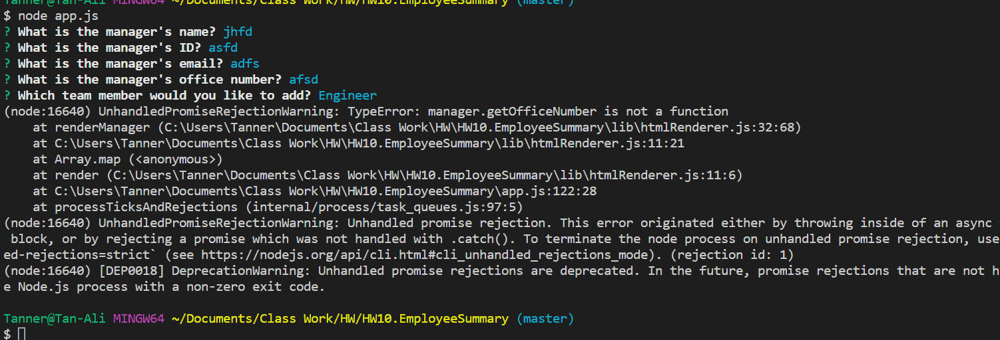

  # # HW10.EmployeeSummary

  

  ## Description

  For this homework we needed to design a software engineering team generator command line application.  The generator would prompt the user for information about each worker such as the manager, intern, or engineer.
  
  ## Table of Contents
  
  * [Installation](#installation)
  * [Usage](#Usage)
  * [License](#License)
  * [Contributing](#Contributing)
  * [Tests](#Tests)
  * [Questions](#Questions)

  ## Installation

  npm i

  ## Usage

  When you type app.js into the terminal, the questons will appear and user will give answers that will create the team template.

  I was not able to get my intern or engineer questons to work which resulted in not being able to render the HTML page.

  ## License

  none

  ## Contributing

  

  1

  ## Tests

  

  ## Questions

  tan-ali5@outlook.com
  
  